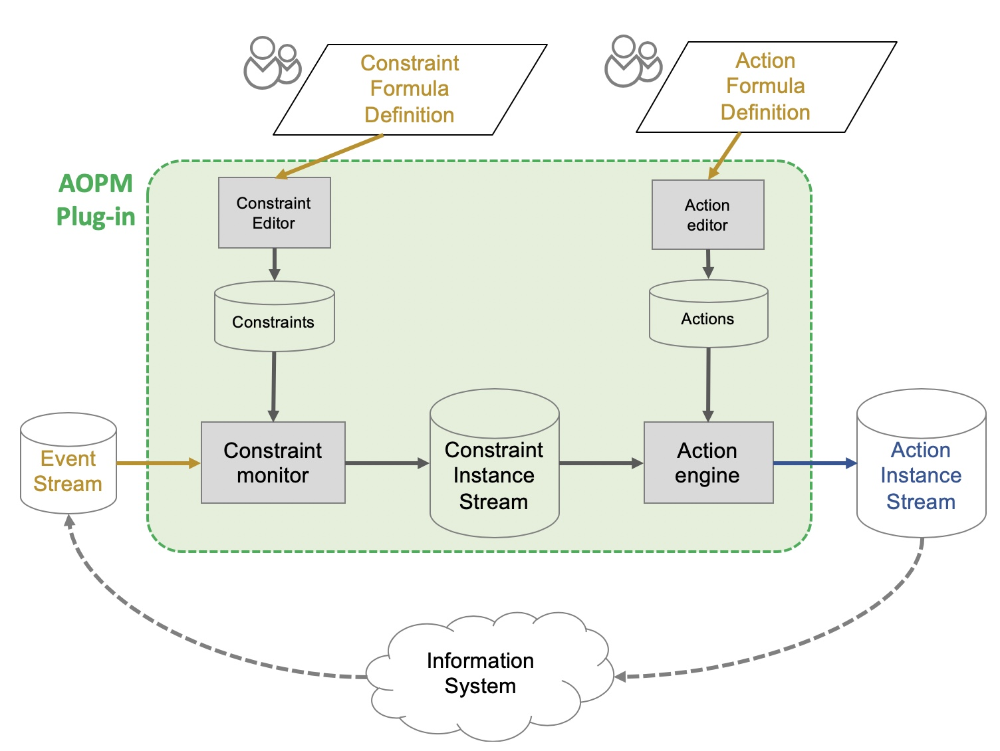
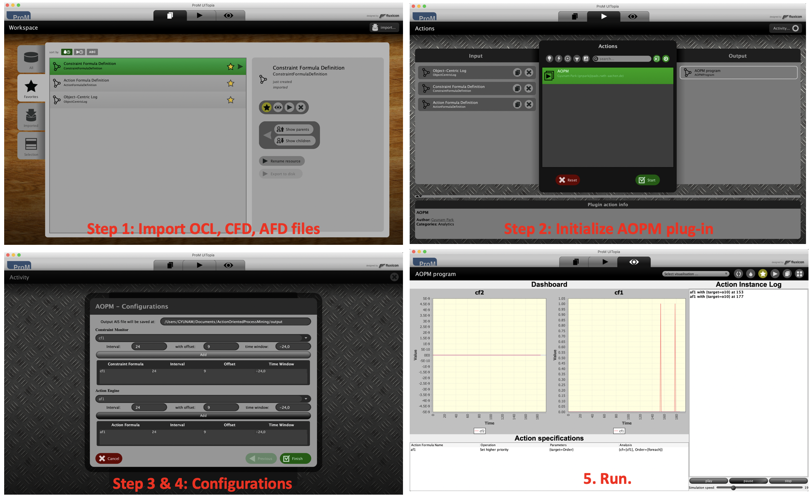

(*Last updated on 29 May. 2020)*

## 0. Overview

This ProM plugin implements **a general framework for action-oriented process mining** that supports the continuous management of operational processes and the automated execution of actions.


This figure shows the overview of ActionOrientedProcessMining (**_AOPM_**) plug-in. It transforms the event stream, which is continuosly generated by information systems, into the action instance stream, which describes mitigating actions that needs to be applied in the information systems to improve the process.

More in detail, the **constraint monitor** evaluates a set of constraints, defined with various diagnostics, by analyzing the event stream. As a result, it generates a constraint instance stream that is the description of (non) violations of these constraints.By analyzing this constraint instance stream, the **action engine** assesses the necessity of actions and generates the actions ranging from process-level valves, instance-level adaptors and alerts.

- Section 1 explains the input and output of this plugin.
- Section 2 explains how to use this plugin.
- Section 3 introduces the experiemental enviornment to facilitate the test of this plugin and explains how to use the environment.
- Section 4 specifies the set of constraints that this plugin supports for the constraint monitor.
- Section 5 is an appendix to give further information on the inputs (i.e., *OCL*, *CFDL*, *AFDL*) and the output (i.e., *AIS*).

## 1. Input and Output

This plugin takes an **event stream**, a **constraint formula definition**, and an **action formula definition** as inputs. In return, it generates an **action instance stream**. Detailed information about input and output is as follows:

### Input

1. **Event stream**

- An event stream is in XML-based Object-Centric Log (*OCL*) format, storing object-centric events introduced in the paper. Each event may refer to different objects from different object classes. The Schema of *OCL* is described in Appendix.

- Example

  ```
  <?xml version="1.0" encoding="UTF-8"?>
  <event-stream>
  <event event-id="889923">
    <process-id>OH</process-id>
    <activity-id>place_order</activity-id>
    <resource-id>Jane</resource-id>
    <timestamp>1</timestamp>
    <object-mapping>
      <object-class type="Order">
        <object-id>o1</object-id>
      </object-class>
      <object-class type="Item">
        <object-id>i1</object-id>
        <object-id>i2</object-id>
      </object-class>
    </object-mapping>
  </event>
  </event-stream>
  ```

  "The event "889923" is about placing order *o1* containing items *i1* and *i2*. The order placement is done by *Jane* at Time *1*."

2. **Constraint Formula Definition (*CFD*)**

- The constraint formulas are defined by *Constraint Formula Definition Language (CFDL)*. The syntax is explained below. More information in the appendix.

  ```
  DEFINE <<contraint formula name>> AS
  CONTEXT <<context description>>
  EVALUATE <<predicate description>>
  ```

- Example

  ```
  DEFINE "cf1"  AS
  CONTEXT "omap"={"Order":{"foreach"}}
  EVALUATE "Throughput", <, 72;
  ```

  The above constraint formula represents that "*cf1*" is a constraint formula which evaluates "*if the throughput time of each order is less than 72 hours*". ```EVALUATE <<predicate description>>``` part decides which type of constraints we want to monitor. ***Section 4*** explains all types of constraints this plug-in supports.

3. **Action Formula Definition (*AFD*)**

- The action formulas are defined by *Action Formula Definition Language (AFDL)*. The syntax is explained below. More information in *Appendix*.

  ```
    DEFINE <<action formula name>> AS
    ANALYZE <<analysis description>>
    ASSESS <<predicate description>>
    OPERATION <<operation name>>
    PARAMTER <<parameter mapping description>>
  ```

- Example

  ```
  DEFINE "af1" AS
  ANALYZE "cf"={"cf1"} & "Order"={"foreach"}
  ASSESS "count",>,0
  OPERATION "Set higher priority"
  PARAMETER "target"="Order";
  ```

  The above action formula represents that "*af1*"is an action formula which generate a transaction regarding "Set higher priority" is there is any violation of *cf1* by any order.

### Output

- **Action Instance Stream (*AIS*)**

  - An action instance stream is in XML-based *AIS* format, storing action instances. The schema of *AIS* is described in *Appendix*.

  - Example

    ```
    <?xml version="1.0" encoding="UTF-8"?>
    <action-instance-stream>
    <action-instance>
      <action-formula>a1-set_higher-priority-for-delayed-orders</action-formula>
      <operation>Set_higher_priority</operation>
      <parameter-mapping>
        <parameter name="target">
          <value>Order</value>
        </parameter>
      </parameter-mapping>
      <timestamp>1</timestamp>
    </action-instance>
    </action-instance-stream>
    ```

##2. How to

### Installation

- (Using ProM nightly build) Download ProM 6 nightly builds and install the package named *ActionOrientedProcessMining*. Detailed installation instruction available [here](http://promtools.org/doku.php?id=nightly).
- (Using svn) Checkout project from https://svn.win.tue.nl/repos/prom/Packages/ActionOrientedProcessMining/. Right-click the "ProM with UITopia (Workshop).launch" file and select "RunAs / ProM with UITopia (Workshop)". Detailed steps available [here](https://svn.win.tue.nl/trac/prom/wiki/Contribute).
- (Using GitHub) clone this project and open the project in any IDE. Right-click the "ProM with UITopia (Workshop).launch" file and select "RunAs / ProM with UITopia (Workshop)".

### Steps

We provide some example files in ```examples/```

1. Import OCL, CFD, AFD files
2. Run AOPM plug-in
3. Configure constraints by selecting a constraint formula and specifying when to monitor it.
4. Configure actions by selecting an action formula and specifying when to execute it.
5. Run it.



## 3. Experimental environment

To facilitate the test of the framework, we provide an experimental environment with an information system simulating an order handling process.

#### Description about the process:

- There are 16 available resources in total at any time and each of them is responsible for multiple activities in the process.
- Orders are randomly placed, and queued for the resource allocation after each activity.
- The resource is allocated according to *First-in First-out* rule.

The figure below shows the overview of the experimental environment.


### Gateway and supporting transactions by the information system

The gateway parses the resulting AIS file and translate the action instances to the system-readable transactions. The following is the list of transactions that can be executed by the information system. In other words, if you define action formulas that conform to the following operations and parameters, you can experience the actual changes in the information system.

- **Process level (Valves)**

  - Task addition

  ```xml
  OPERATION "Add task"
  PARAMETER "task-id"=<task-identifier>, "preceded-by"=<preceding-task-identifier>,
  "followed-by"=<follwoing-task-id>
  ```

  - Task elimination

  ```xml
  OPERATION "Eleminate task"
  PARAMETER "task-id"=<task-identifier>, "preceded-by"=<preceding-task-identifier>,
  "followed-by"=<follwoing-task-id>
  ```

  - Change to SPT

  ```xml
  OPERATION "Change routing rule"
  PARAMETER "new-routing-rule"=<routing-rule-id>
  ```

  - Change maximum capacity

  ```xml
  OPERATION "Change maximum capacity"
  PARAMETER "change-rate"=<rate-value>
  ```

  - Add resource

  ```xml
  OPERATION "Add resource"
  PARAMETER "resource-id"=<resoure-identifier>, "target-task"=<task-identifier>
  ```

- **Instance level (Adaptors)**

  - Task cancellation

  ```xml
  OPERATION "Cancel the task"
  PARAMETER "target"=<object-identifer> "task-id"=<task-identifier>
  ```

  - Restart

  ```xml
  OPERATION "Restart the instance"
  PARAMETER "target"=<object-idenfier>
  ```

  - Change Priority

  ```xml
  OPERATION "Change priority"
  PARAMETER "target"=<object-idenfier>, "change-priority"=<change-value>
  ```

- **Alert**

  - Send an email

  ```xml
  OPERATION "send an email"
  PARAMETER "recipient"=<employee-identifier>, "message"=<text>
  ```

### How-to

1. Import CFD and AFD files.
2. Run _Synthetic Information System_ plug-in on ProM framework.
3. With that being one of the input, you can initiate the AOPM plug-in. This time, you don't have to configure a filepath for an event stream. This process is done internally.
4. Configure constraints by selecting a constraint formula and specifying when to monitor it.
5. Configure actions by selecting an action formula and specifying when to execute it.
6. Run it.
7. The gateway implemented in the information system automatically translates the action instance stream into transactions and updates the information system.

## 4. Supported constraints

Below is the list of constraints this plug-in supports. We explain the syntax to be used when defining constraint formulas for each type of constraints.

## Instance-level

#### Control-flow

- **Existence**: Limits occurrence of an activity.
  - Syntax: ```"Existence",activity-id```
  - Example: "check availability" occurs in the instance
    - ```"Existence","check availability"```
- **Non-Existence**: Limits absence of an activity.
  - Syntax: ```"Non-existence",activity-id```
  - Example: "check availability" do not occur in the instance
    - ```"Non-existence","check availability"```
- **Bounded Existence**: Limits the number of times an activity must occur.
  - Syntax: ```"Bounded-Existence" activity-id, num-execution```
  - Example: "check availability" must occur at least twice in the instance
    - ```"Bounded-Existence","check availability", 2```
- **Bounded Non-Existence**: Limits the number of times an activity must not occur.
  - Syntax: ```"Bounded-Non-Existence" activity-id, num-execution```
  - Example: "check availability" must not occur more than twice in the instance
    - ```"Bounded-Non-Existence","check availability", 2```

- **Sequence Existence**: Limits the presence of an activity with respect to existence of another activity.
  - Syntax: ```"Sequence-Existence" ,condition-activity-id,target-activity-id```
  - Example: "placeorder" is directly followed by "check availability".
    - ```"Sequence-Existence","place order", "check availability"```
- **Seqeunce Non-Existence**: Limits the absence of an activity with respect to existence of another activity.
  - Syntax: ```"Seqeunce-Non-existence",condition-activity-id,target-activity-id```
  - Example: "place order" is never directly followed by "check availability".
    - ```"Seqeunce-Non-Existence","place order","check availability"```

- **Dependent Existence**: Limits the presence of an activity with respect to existence of another activity.
  - Syntax: ```"Dependent-Existence",condition-activity-id,target-activity-id,sequence-length```
  - Example: "placeorder" is followed by "check availability" eventually in two events.
    - ```"Dependent-Existence","placeorder", "check availability",2```
- **Dependent Non-existence**: Limits the absence of an activity with respect to existence of another activity.
  - Syntax: ```"Dependent Non-Existence" condition-activity-id,target-activity-id,sequence-length```
  - Example: "placeorder" is never followed by "check availability" eventually in two events.
    - ```""Dependent Non-Existence","placeorder", "check availability",2```
- **Bounded Dependent Existence**: Limits the number of times an activity must occur with respect to existence of another activity.
  - Syntax: ```"Bounded-Dependent-Existence" condition-activity-id,target-activity-id,sequence-length,num-execution```
  - Example: "placeorder" is followed by "check availability" eventually in two events at least twice.
    - ```"Bounded-Dependent-Existence","placeorder", "check availability",2,2```
- **Bounded Dependent Non-existence**: Limits the number of times an activity must not occur with respect to existence of another activity.
  - Syntax: ```"Bounded-Dependent-Non-Existence" condition-activity-id,target-activity-id,sequence-length,num-execution```
  - Example: "placeorder" is never followed by "check availability" eventually in two events more than twice.
    - ```"Bounded-Dependent-Non-Existence","placeorder", "check availability",2,2```
- **Precedence**: Limits the occurrence of an activity in precedence over another activity.
  - Syntax: ```"Precedence" preceding-activity-id, condition-activity-id, num-execution```
  - Example: "placeorder" is preceded by "check availability" at least twice.
    - ```"Precedence","placeorder", "check availability",2```

### Time

- **Throughput**:
  - Syntax: ```"Throughput",comparator,threshould```

## Process-level

### Control-flow

- **Object-Capacity**: Limits the upper/lower number of objects in the process
  - Syntax: ```Object-Capacity, object-id, comparator, threshold```
  - Example:  The number of ongoing orders in the process must be less than 25.
    - ```"Object-Capacity", "Order", <, 25```

## 5. Appendix

### 5.1. Event Stream Format

Below is the schema of an event stream.

```
<?xml version="1.0" encoding="UTF-8" ?>
<xs:schema xmlns:xs="http://www.w3.org/2001/XMLSchema">
  <xs:element name="event-stream">
    <xs:element name="event" maxOccurs="unbounded">
      <xs:complexType>
        <xs:sequence>
          <xs:element name="process-id" type="xs:string"/>
          <xs:element name="activity-id" type="xs:string"/>
          <xs:element name="resource-id" type="xs:string"/>
          <xs:element name="timestamp" type="xs:positiveInteger"/>
          <xs:element name="object-mapping">
            <xs:complexType>
              <xs:element name="object-class" maxOccurs="unbounded">
                <xs:complexType>
                  <xs:sequence>
                    <xs:element name="object-id" maxOccurs="unbounded">
                  </xs:sequence>
                  <xs:attribute name="type" type="xs:string" use="required"/>
                </xs:complexType>
              </xs:element>
            </xs:complexType>
          </xs:element>
        </xs:sequence>
        <xs:attribute name="event-id" type="xs:string" use="required"/>
      </xs:complexType>
    </xs:element>
  </xs:element>
</xs:schema>
```

### 5.2. Constraint Formula Definition Language

We define constraint formulas with the constraint formula definition language.

```
DEFINE <<contraint formula name>> AS
CONTEXT <<context description>>
FILTER <<filter description>>
EVALUATE <<predicate description>>
```

Detailed explanations:

- ```<<contraint formula name>>```: the name of the constraint formula
- ```<<context description>>```: the context that is defined in the paper in key-value format.
  - Keys: "Proc", "Act", "Res", "omap", "vmap"
    - "Proc", "Act", "Res": {values}
    - "omap":{Obj:{values}}
    - "vmap":{Attr:{values}}
- ```<<predicate description>>```: see (*3. Supported constraints*), where the supported predicates are explained with the syntax.

### 5.3. Action Formula Definition Language

  We define action formulas with the action formula definition language. The simplified syntax if as follows:

```
  DEFINE <<action formula name>> AS
  ANALYZE <<analysis description>>
  ASSESS <<predicate description>>
  OPERATION <<operation name>>
  PARAMTER <<parameter mapping description>>
```

Detailed explanations:

- ```<<action formula name>>```: the name of the action formula
- ```<<analysis description>>```: specifying the constraint instances to analyze in key-value format
  - Keys: "cf", "proc", "act", "res", ObjectClass, AttributeName
    - ObjectClass: the object classes defined in the process (e.g., Order, Item, etc)
    - AttributeName: the attributes defined in the process (e.g., Type,Price, etc)
    - "cf", "proc", "act", "res", ObjectClass, AttributeName: {values}
- ```<<predicate description>>```
  - ```aggregation,comparator,threshold```
  - Aggregation includes "count", "ratio", "mean", "median", etc.
  - Numerical comparator (i.e., <,>,=) is used to assess the necessity of operations.
  - Threshold is numerical.
- ```<<operation name>>```: the name of operation to be executed
- ```<<parameter mapping description>>```: the mappings of paramters that are required for the execution of the operation in key-value format.
  - "ParameterName": "ParameterValue"

### 5.4. Action Instance Stream Format

Below is the schema of an action instance stream.

```
  <?xml version="1.0" encoding="UTF-8" ?>
  <xs:schema xmlns:xs="http://www.w3.org/2001/XMLSchema">

  <xs:element name="action-instance-stream">
      <xs:element name="action-instance" maxOccurs="unbounded">
        <xs:complexType>
          <xs:sequence>
            <xs:element name="action-formula" type="xs:string"/>
            <xs:element name="operation" type="xs:string"/>
            <xs:element name="parameter-mapping">
              <xs:complexType>
                <xs:element name="parameter" maxOccurs="unbounded">
                  <xs:complexType>
                    <xs:sequence>
                      <xs:element name="value" maxOccurs="unbounded">
                    </xs:sequence>
                    <xs:attribute name="name" type="xs:string" use="required"/>
                  </xs:complexType>
                </xs:element>
              </xs:complexType>
            </xs:element>
            <xs:element name="timestamp" type="xs:positiveInteger"/>
          </xs:sequence>
        </xs:complexType>
      </xs:element>
  </xs:element>
  </xs:schema>
```


## Remark

- contact gnpark@pads.rwth-aachen.de for more information